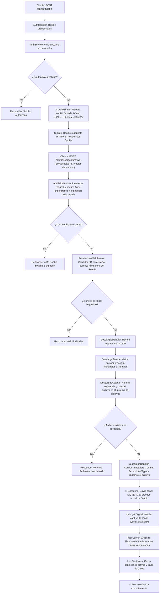

# 🚀 Go API - Arquitectura Hexagonal (Zero-Dependency)

API RESTful construida en Go siguiendo los principios de la **Arquitectura Hexagonal (Puertos y Adaptadores)**. 

Diseñada para ser **100% portable y autocontenida**: no requiere Docker, Kubernetes, PostgreSQL ni Redis. Funciona nativamente con **SQLite** y autenticación **stateless** basada en cookies firmadas.

---

## 📁 **ESTRUCTURA DEL PROYECTO**

```bash
go-api/
├── 📄 go.mod
├── 📄 go.sum
├── 📄 .env
├── 📄 .gitignore
├── 📁 cmd/
│   └── 📁 api/
│       └── 📄 main.go                 # Punto de entrada de la aplicación
├── 📁 config/
│   └── 📄 config.go                   # Carga de variables de entorno
├── 📁 internal/
│   ├── 📁 app/
│   │   └── 📄 app.go                  # Orquestador de dependencias (DI)
│   ├── 📁 core/                       # 🎯 DOMINIO (Lógica de negocio pura)
│   │   ├── 📁 auth/
│   │   │   ├── 📄 entities.go
│   │   │   ├── 📄 ports.go
│   │   │   └── 📄 service.go
│   │   ├── 📁 estados/
│   │   ├── 📁 login/
│   │   ├── 📁 permisos/
│   │   ├── 📁 roles/
│   │   └── 📁 usuarios/
│   ├── 📁 infrastructure/             # 🏗️ ADAPTADORES (Implementaciones concretas)
│   │   ├── 📁 adapters/               # Implementación de puertos del core
│   │   ├── 📁 cookies/                # Firmado y verificación de cookies
│   │   ├── 📁 database/
│   │   │   ├── 📄 database.go         # Conexión y configuración de SQLite
│   │   │   ├── 📄 db_manager.go
│   │   │   └── 📁 models/
│   │   │       └── 📄 tables.go       # Modelos GORM
│   │   ├── 📁 jwt/
│   │   └── 📁 repositories/           # Repositorios para lógica de auth específica
│   └── 📁 interfaces/                 # 🌐 ENTRADAS (Controladores HTTP)
│       └── 📁 api/
│           ├── 📁 common/
│           ├── 📁 handlers/           # Controladores por entidad
│           ├── 📁 middlewares/
│           │   ├── 📄 auth.go
│           │   ├── 📄 permissions.go
│           │   └── 📄 permissions_constants.go
│           └── 📁 routes/
│               └── 📄 routes.go       # Enrutamiento y cadena de middlewares
├── 📁 pkg/
│   ├── 📁 logger/
│   │   └── 📄 logger.go
│   └── 📁 utils/
│       ├── 📄 password.go
│       └── 📄 validators.go
└── 📁 dist/                           # 📂 Carpeta por defecto para archivos descargables
```

---

## ⚙️ **CONFIGURACIÓN E INICIO**

### 1. Variables de Entorno
Crea un archivo `.env` en la raíz del proyecto. Puedes generar las claves secretas con:  
`openssl rand -base64 32`

```env
PORT=3000
ENV=Development

# Base de datos (SQLite)
DB_PATH=app.db

# Autenticación y Seguridad (¡Cambia estos valores en producción!)
JWT_SECRETO=pega_aqui_tu_clave_secreta_de_32_caracteres_1
COOKIE_SECRET=pega_aqui_tu_clave_secreta_de_32_caracteres_2
JWT_TIEMPO_EXPIRA=3600
```

### 2. Instalación de dependencias
```bash
go mod tidy
```

### 3. Ejecución en desarrollo
```bash
go run cmd/api/main.go
```

### 4. Compilación para producción (Binario autocontenido)
```bash
go build -o api-server cmd/api/main.go
./api-server
```
*(Solo necesitas el ejecutable, el archivo `.env` y la carpeta `dist/` para correr en cualquier servidor).*

---

## 🏛️ **ARQUITECTURA HEXAGONAL**

### Flujo de Datos (Request)
```text
HTTP Request 
  → Routes 
  → Middlewares (Auth con Cookie Firmada → Permisos)
  → Handlers (Validan DTOs y adaptan HTTP → Core)
  → Services (Lógica de negocio pura)
  → Ports (Interfaces del dominio)
  → Adapters/Repositories (Implementación concreta en SQLite)
  → SQLite (app.db)
```

### Flujo de Datos (Response)
```text
SQLite 
  → Adapters (Mapean DB Models → Entidades del Core)
  → Services 
  → Handlers (Mapean Entidades → DTOs de Respuesta)
  → HTTP Response (JSON estandarizado)
```

### Reglas de Oro del Proyecto
1. **El Core no conoce nada del exterior:** No hay imports de `gorm`, `http`, `json` o `redis` en la carpeta `internal/core/`.
2. **Stateless:** No hay sesiones en servidor. La validez del usuario se determina exclusivamente verificando la firma y fecha de expiración de la cookie `tk`.
3. **Zero-Dependency:** La aplicación no depende de servicios externos corriendo en segundo plano.

---

## 🛠️ **COMANDOS ÚTILES**

### 🔐 Generar claves seguras para el `.env`
```bash
echo "JWT_SECRETO=$(openssl rand -base64 32)"
echo "COOKIE_SECRET=$(openssl rand -base64 32)"
```

### 🗄️ Inspeccionar la base de datos SQLite (si tienes sqlite3 instalado)
```bash
sqlite3 app.db ".tables"
sqlite3 app.db "SELECT * FROM usuarios;"
```
*(Alternativa gráfica: Usar "DB Browser for SQLite" y abrir el archivo `app.db`)*.

### 🧹 Limpiar y reconstruir
```bash
go clean
rm -f app.db          # ⚠️ Esto borra la base de datos local
go mod tidy
go build -o api-server cmd/api/main.go
```

---

## 📊 **Diagrama**



---

## 📊 **INSERCIÓN DE DATOS BASE (Seed)**

La aplicación crea las tablas automáticamente mediante `GORM AutoMigrate`. Para insertar roles y permisos iniciales, puedes usar cualquier cliente SQLite y ejecutar:

```sql
BEGIN;

-- 1. Insertar rol admin
INSERT INTO roles (nombre_rol, descripcion) 
VALUES ('admin', 'Rol de administrador con todos los permisos del sistema');

-- 2. Insertar permisos base
INSERT INTO permisos (nombre_permiso, descripcion) VALUES
('estado:listar', 'Permiso para listar estados'),
('estado:crear', 'Permiso para crear estados'),
('permiso:listar', 'Permiso para listar permisos'),
('rol:crear', 'Permiso para crear roles'),
('usuario:crear', 'Permiso para crear usuarios'),
('usuario:editar', 'Permiso para editar usuarios'),
('login:logout', 'Permiso para hacer logout'),
('admin', 'Permiso de administrador')
ON CONFLICT (nombre_permiso) DO NOTHING;

-- 3. Asignar permisos al rol admin (Ajusta los IDs según tu BD)
INSERT INTO rol_x_permisos (id_rol, id_permiso)
SELECT (SELECT id FROM roles WHERE nombre_rol = 'admin'), id
FROM permisos
ON CONFLICT (id_rol, id_permiso) DO NOTHING;

COMMIT;
```

---

## 🔐 **NOTA SOBRE AUTENTICACIÓN**

El sistema utiliza un enfoque **híbrido stateless**:
1. El cliente envía sus credenciales (`email`/`password`).
2. El servidor valida y genera una **Cookie Firmada (`tk`)** usando HMAC-SHA256.
3. La cookie contiene: `UserID`, `Username`, `RoleID` y `ExpiresAt`.
4. En cada petición, el `AuthMiddleware` verifica la firma criptográfica y la fecha de expiración. **No se consulta a la base de datos ni a una caché para validar la sesión**, lo que garantiza un rendimiento máximo y escalabilidad horizontal inmediata.
5. El `PermissionsMiddleware` extrae el `RoleID` de la cookie ya validada y consulta la BD *solo* para obtener la lista de permisos de ese rol (optimizable con caché interna si el proyecto crece, pero sin dependencias externas).